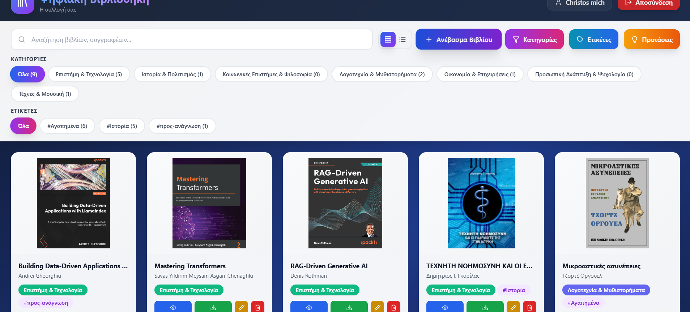
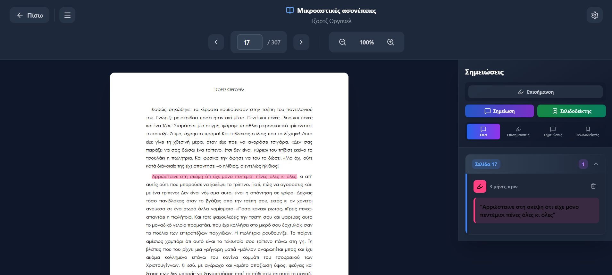
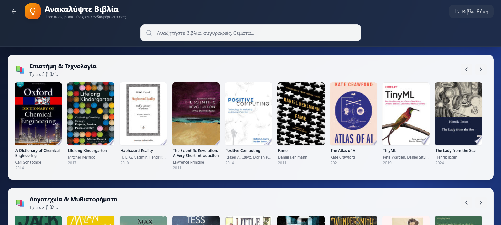

# Digital Personal Library

A full-stack web application for managing personal ebook collections. Built as my Bachelor's thesis at the University of Piraeus.

The idea came from my own frustration with managing PDFs across different folders and apps. I wanted one place to store books, read them, take notes, and discover new ones.



## Features

- Upload and manage PDF books with metadata and cover images
- Built-in PDF reader with multi-line text highlighting (5 colors)
- Notes and bookmarks on any page
- Organize books with categories and tags
- Automatic reading progress tracking
- Book recommendations based on your library (via Google Books API)

## Tech Stack

| Layer | Technologies | Why |
|-------|--------------|-----|
| Frontend | React 19, Tailwind CSS, Zustand | React for component architecture, Zustand for simple state management without Redux boilerplate |
| Backend | Node.js, Express 5, Sequelize | JavaScript throughout the stack, Sequelize for type-safe database queries |
| Database | PostgreSQL | Relational data with complex relationships between books, categories, tags, and annotations |
| Auth | JWT + bcrypt | Stateless authentication, secure password hashing |

## Architecture

```
┌──────────────────┐     HTTP/JSON      ┌──────────────────┐
│                  │    + JWT Auth      │                  │
│  React Frontend  │◄──────────────────►│  Express API     │
│  (SPA)           │                    │  (47 endpoints)  │
│                  │                    │                  │
└──────────────────┘                    └────────┬─────────┘
                                                 │
                                                 │ Sequelize ORM
                                                 ▼
                                        ┌──────────────────┐
                                        │   PostgreSQL     │
                                        │   (9 tables)     │
                                        └──────────────────┘
```

The frontend is a single-page application that communicates with the backend through REST endpoints. All routes except login/register require a valid JWT token.

## Database Design

```
Users
  │
  ├── Books ◄───────┬───────► Categories (many-to-many)
  │     │           │
  │     │           └───────► Tags (many-to-many)
  │     │
  │     ├── Annotations (highlights, notes, bookmarks)
  │     │
  │     └── ReadingProgress
  │
  └── UserPreferences
```

9 tables total: 7 main entities + 2 junction tables for the many-to-many relationships.

## Technical Challenges

### Multi-line Highlighting

The trickiest part was implementing text highlighting that works across multiple lines. PDF text selection can span several lines, and each line segment needs its own position data for the highlight to render correctly.

Solution: Store an array of position rectangles per highlight:
```javascript
{
  highlightedText: "Text spanning multiple lines...",
  positions: [
    { x: 72, y: 300, width: 450, height: 14 },
    { x: 72, y: 316, width: 380, height: 14 }
  ],
  color: "#ffeb3b",
  pageNumber: 45
}
```

The reader then draws a semi-transparent rectangle for each position.

### Recommendation Engine

The system analyzes your library to suggest new books:

1. Count books per category and author
2. Query Google Books API for similar content
3. Translate Greek categories to English (e.g., "Επιστήμη" → "Science")
4. Filter: must have cover image, published after 2010
5. Deduplicate results by title

Added exponential backoff (500ms → 1s → 2s) to handle API rate limits gracefully.

## Project Stats

- **~8,000** lines of code
- **47** API endpoints
- **9** database tables
- **45** files across frontend and backend

## Screenshots

### PDF Reader


Annotations sidebar shows highlights, notes, and bookmarks grouped by page. The reader saves your position automatically.

### Recommendations


Personalized suggestions based on your most-read categories and authors.

## Running Locally

**Requirements:** Node.js 18+, PostgreSQL 14+

```bash
git clone https://github.com/Chrimich02/digital-library.git
cd digital-library

# Database
createdb digital_library

# Backend
cd backend
cp .env.example .env  # Then edit with your DB credentials
npm install
npm run dev

# Frontend (new terminal)
cd frontend
npm install
npm start
```

App runs at http://localhost:3000

### Environment Variables

```env
# backend/.env
DB_HOST=localhost
DB_PORT=5432
DB_NAME=digital_library
DB_USER=postgres
DB_PASSWORD=your_password

JWT_SECRET=your_secret_key
JWT_EXPIRES_IN=7d

PORT=5000

GOOGLE_BOOKS_API_KEY=your_api_key  # Optional, for recommendations
```

## API Overview

| Method | Endpoint | Description |
|--------|----------|-------------|
| POST | /api/auth/register | Create account |
| POST | /api/auth/login | Login, get JWT |
| GET | /api/books | List books (paginated) |
| POST | /api/books | Upload book (multipart) |
| GET | /api/books/:id/view | Stream PDF for reader |
| POST | /api/annotations | Create highlight/note/bookmark |
| GET | /api/recommendations | Get personalized suggestions |

Full CRUD available for books, categories, tags, and annotations.

## Project Structure

```
├── backend/
│   ├── controllers/    # Request handlers (9 files)
│   ├── models/         # Sequelize models (7 files)
│   ├── routes/         # API routes
│   ├── middleware/     # Auth, error handling
│   └── uploads/        # PDF and cover storage
│
└── frontend/
    └── src/
        ├── components/ # Reusable UI components
        ├── pages/      # Route pages (8 files)
        ├── services/   # API client functions
        └── store/      # Zustand auth store
```

## Limitations

- PDF only (no EPUB support yet)
- Local file storage (no cloud)
- No automated tests
- Single-user focus (no sharing features)

## Future Improvements

- EPUB format support
- Cloud storage integration
- Full-text search within PDFs
- Reading statistics dashboard
- Export annotations to Markdown

---

**University of Piraeus** — Department of Informatics — Bachelor's Thesis 2025